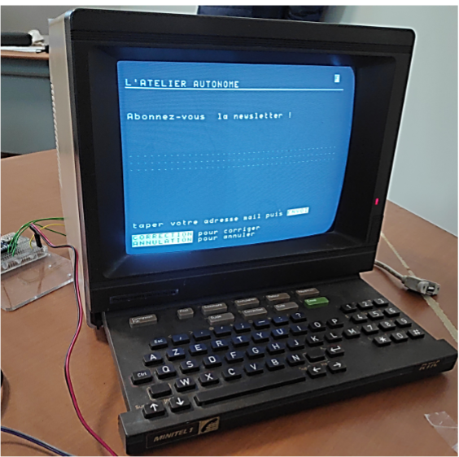
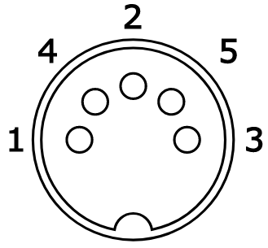

# 📟 Minitel Newsletter Arduino

Projet Arduino permettant de transformer un **Minitel 1B** en terminal de saisie pour enregistrer des adresses email dans un fichier CSV sur carte SD.

Le système propose une interface interactive de type 3615 permettant la saisie, correction et validation via clavier Minitel.

---

## ✨ Fonctionnalités

- Interface utilisateur sur Minitel (style 3615)
- Saisie de texte (email)
- Gestion clavier Minitel :
  - ENVOI (validation)
  - CORRECTION (backspace)
  - ANNULATION (reset champ)
- Timeout automatique (30 secondes)
- Enregistrement des données sur carte SD au format CSV
- Affichage de confirmation

---

## 📸 Aperçu

  

---

## 🧠 Principe de fonctionnement

1. Le Minitel affiche une page d’accueil
2. L’utilisateur saisit son email
3. L’Arduino récupère les touches via liaison série
4. Les données sont stockées dans `mailling.csv` sur carte SD
5. Un message de confirmation est affiché

---

## 🔧 Matériel requis

- Arduino Nano ou Arduino Uno
- Minitel 1B
- Connecteur DIN5 male
- Module carte SD (SPI)
- Carte microSD (format FAT32)

---

## 📚 Dépendances

Ce projet utilise la bibliothèque :

Minitel1B_Soft  
https://github.com/eserandour/Minitel1B_Soft

Installation :
- Arduino IDE → "Add ZIP Library"
- ou installation manuelle dans `libraries/`

---

## 🔌 Branchement Minitel ↔ Arduino

### 📟 Connecteur DIN Minitel

| DIN Minitel | Fonction | Arduino |
|------------|--------|--------|
| DIN 1      | RX     | TX (D6 ou SoftwareSerial TX) |
| DIN 3      | TX     | RX (D7 ou SoftwareSerial RX) |
| DIN 2      | GND    | GND |
| DIN 5      | +8.5V  | Alimentation Vin|
| DIN 4      | —      | Non connecté |

Numéros pins DIN connecteur mâle :

  

---

## ⚠️ Résistance pull-up obligatoire

La sortie TX du Minitel est en collecteur ouvert.

### Schéma :

DIN 3 (TX Minitel)  
&nbsp;&nbsp;&nbsp;&nbsp;│  
&nbsp;&nbsp;&nbsp;&nbsp;├───> RX Arduino  
&nbsp;&nbsp;&nbsp;&nbsp;│  
&nbsp;&nbsp;&nbsp;&nbsp;R = 10 kΩ  
&nbsp;&nbsp;&nbsp;&nbsp;│  
&nbsp;&nbsp;&nbsp;&nbsp;+5V Arduino 

---

## 💾 Connexion carte SD (SPI)

| Arduino Nano | Module SD |
|-------------|----------|
| D4          | CS       |
| D11         | MOSI     |
| D12         | MISO     |
| D13         | SCK      |
| 5V          | VCC      |
| GND         | GND      |

---

## 📁 Format des données

Fichier :

mailling.csv

Exemple :

email@example.com  
email2@example.com  

---

## 🖥️ Interface utilisateur

### Écran :
- Titre : “L’ATELIER AUTONOME” <--- A Modifier
- Message d’accueil

### Saisie :
- 2 lignes de 40 caractères

### Touches :
- ENVOI → valider
- ANNULATION → reset
- CORRECTION → supprimer caractère

---

## ⏱️ Sécurité

- Timeout : 30 secondes
- Protection buffer
- Reset automatique champ

---

## ⚠️ Limitations

- Pas de validation email
- Stockage local uniquement
- Compatible Minitel 1B uniquement

---

## 🔧 Améliorations possibles

- Validation email
- Ajout date (RTC)
- Export CSV enrichi
- Interface multi-pages
- Version réseau (ESP32)

---

## 📜 Licence

Projet sous licence GPLv3

GNU GENERAL PUBLIC LICENSE v3

---

## 🚀 Auteur

L'Atelier Autonome Rouen

Librairie : Minitel1B_Soft (eserandour)
